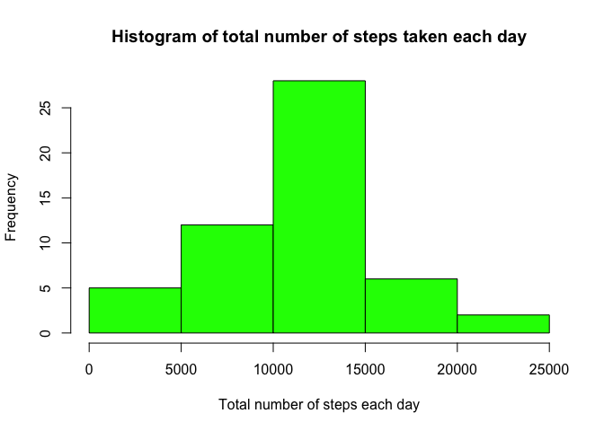
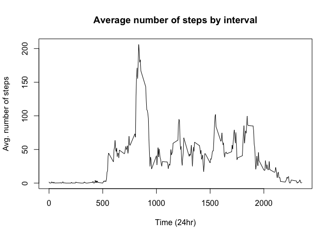
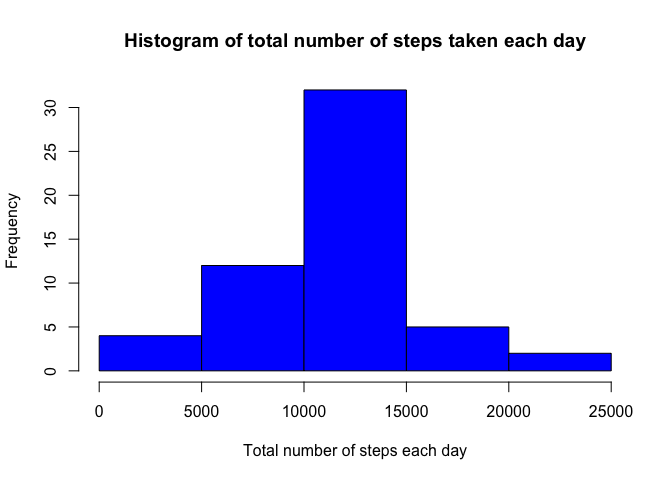
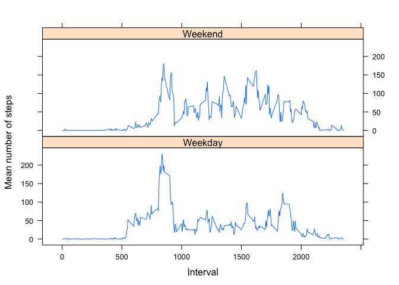

# Reproducible Research: Peer Assessment 1
Alson Yap  


## 1 Loading and preprocessing the data
#### 1.1 Loading the data
To start off, let's unzip the `activity.zip` file provided and then load the `activity.csv` file provided into RStudio.

Assuming that the unzipping has been done, the file will then be loaded. In addition, the packages that will be used will also be loaded here.

```r
activity <- read.csv("activity.csv", header = TRUE)
library(dplyr)
library(ggplot2)
library(lattice)
library(knitr)
```
Let's get a feel of what the data is about to decide if we should pre-process the data before analysis.

```r
str(activity)
```

```
## 'data.frame':	17568 obs. of  3 variables:
##  $ steps   : int  NA NA NA NA NA NA NA NA NA NA ...
##  $ date    : Factor w/ 61 levels "2012-10-01","2012-10-02",..: 1 1 1 1 1 1 1 1 1 1 ...
##  $ interval: int  0 5 10 15 20 25 30 35 40 45 ...
```

```r
head(activity)
```

```
##   steps       date interval
## 1    NA 2012-10-01        0
## 2    NA 2012-10-01        5
## 3    NA 2012-10-01       10
## 4    NA 2012-10-01       15
## 5    NA 2012-10-01       20
## 6    NA 2012-10-01       25
```
As we see that there is a date column but it is of factor class. This will then be converted into the date class with `as.Date()` function.

#### 1.2 Preprocessing the data

```r
activity$date <- with(activity, as.Date(as.character(date), '%Y-%m-%d'))
```
After this has been done, we can proceed to answering the questions listed below.

## 2 What is mean total number of steps taken per day?
#### 2.1 Total number of steps taken per day
To do this, we can use the `dplyr` package to aggregate the number of steps taken per day.

```r
# Aggregates the number of steps per day
steps_per_day <- activity %>% group_by(date) %>% summarize(totsteps = sum(steps))
```

#### 2.2 Histogram of total number of steps taken each day
The code for plotting this histogram is shown below. 

```r
# Converts the date column into date class 
steps_per_day$date <- as.character(steps_per_day$date)

# Plots the graph
hist(steps_per_day$totsteps, main = 'Histogram of total number of steps taken each day', 
     xlab = 'Total number of steps each day', ylab = 'Frequency', col = 'green')
```

<!-- -->

#### 2.3 Mean and median of the total number of steps taken per day
To find out the mean of the total number of steps taken per day, we will use the `mean` function.

```r
mean(steps_per_day$totsteps, na.rm=TRUE)
```

```
## [1] 10766.19
```
The mean number of steps taken each day is approximately **10,766** steps!

Next, to find out the median number of steps taken each day, we simply use the `median` function.

```r
median(steps_per_day$totsteps, na.rm = TRUE)
```

```
## [1] 10765
```
The median number of steps taken each day is **10,765** steps!

Moving on to the next part of question...

## 3 What is the average daily activity pattern?
#### 3.1 Make a time series plot (i.e. type = 'l') of the 5-minute interval (x-axis) and the average number of steps taken, averaged across all days (y-axis)

To go about doing this, the mean number of steps taken for each 5-minute interval will be calculated, and then plotted.


```r
# Finds out the mean of number of steps per interval
avg_steps_int <- activity %>% group_by(interval) %>% summarise(meansteps = mean(steps, na.rm=TRUE))

# Plots the graph of mean number of steps by interval
with(avg_steps_int, plot(interval, meansteps, type = 'l', 
                    main = 'Average number of steps by interval',
                    xlab = 'Time (24hr)',
                    ylab = 'Avg. number of steps'))
```

<!-- -->

The highest point seems to occur around 0800 hours, let's find out the interval deterministically. 

#### 3.2 Which 5-minute interval, on average across all days, contains the maximum number of steps taken?

```r
avg_steps_int$interval[which.max(avg_steps_int$meansteps)]
```

```
## [1] 835
```
The 5-minute interval that has the maximum number of steps, averaged across all days, is at **835** (i.e. 8.35 AM).

## 4 Imputing missing values
#### 4.1 Calculate and report the total number of rows with NAs

```r
sum(is.na(activity$steps))
```

```
## [1] 2304
```
The total number of rows with NAs is **2304**.

#### 4.2 & 4.3 Devise a strategy to fill in all of the missing values in the dataset and create a new dataset with its missing values replaced
For this part, we shall **impute those NA's with the mean values at its corresponding 5-minute interval**. Thus, this will require heavy referencing to the `avg_steps_int` dataframe created previously.


```r
# Creates a new dataset similar to the original dataset
activity_comp <- activity

# Finds out the indexes of those rows with NA values
na_index <- which(is.na(activity_comp$steps))

for (i in 1:length(na_index)) {
    # Retrieves the 5-minute interval for that particular row with NA value
    temp_interval <- activity_comp[i, 'interval']
    # References to the avg_steps_int table, finds out the mean number of steps for that interval of interest
    mean_step <- filter(avg_steps_int, interval == temp_interval)$meansteps
    # Replaces the NA value with the mean number of steps found
    activity_comp[i, 'steps'] <- mean_step
}
```

#### 4.4 Make a histogram of the total number of steps per day, and calculate the mean and median total number of steps taken per day (similar to Part 1)

These steps will be similar to those in Part 1.


```r
# Aggregates the number of steps per day
comp_steps_per_day <- activity_comp %>% group_by(date) %>% summarise(totsteps = sum(steps))

# Plots the graph
hist(comp_steps_per_day$totsteps, main = 'Histogram of total number of steps taken each day', 
     xlab = 'Total number of steps each day', ylab = 'Frequency', col = 'blue')
```

<!-- -->

The distribution of the histogram looks the same, but the frequency has definitely increased.

To find out the mean of the total number of steps taken per day, we will use the `mean` function.

```r
mean(comp_steps_per_day$totsteps, na.rm=TRUE)
```

```
## [1] 10789.35
```
The mean number of steps taken each day has increased from **10,766 to 10,789** which is not surprising as the NA values have been filled in with values of 0 and more.

Next, to find out the median number of steps taken each day, we simply use the `median` function.

```r
median(comp_steps_per_day$totsteps, na.rm = TRUE)
```

```
## [1] 10766.19
```
The median number of steps taken each day has now increased slightly from **10,765 to 10,766.19**. This is also to be expected from the reasoning above.

Moving on to the last part of the assignment.

## 5 Are there differences in activity patterns between weekdays and weekends?

This part requires us to first create a new factor variable in the dataset with 2 levels - 'weekday' and 'weekend' for each of the date in the dataset.


```r
# Creates a new column for the name of the day
activity_comp <- mutate(activity_comp, day = weekdays(activity_comp$date))

# Reclassify into weekdays vs weekends
activity_comp$day <- ifelse(activity_comp$day %in% c("Saturday","Sunday"), yes = 'Weekend', 
                            no = 'Weekday')

# Calculates the average number of steps taken by intervals by weekdays/weekends
avg_int_day <- activity_comp %>% group_by(interval, day) %>% 
    summarise(meansteps = mean(steps, na.rm = TRUE))
```

Now that we have the dataset required to plot the graph, let's use the `lattice` package to plot to determine if there's a difference in steps taken between weekdays and weekends.


```r
xyplot(meansteps ~ interval | day, data = avg_int_day, type = "l", layout = c(1,2), 
       xlab = "Interval", ylab = "Mean number of steps")
```

<!-- -->


This concludes the end of the assignment, thanks for your time reviewing and hope it was easy to understand.

Feel free to let me know if you have any comments, thanks!
